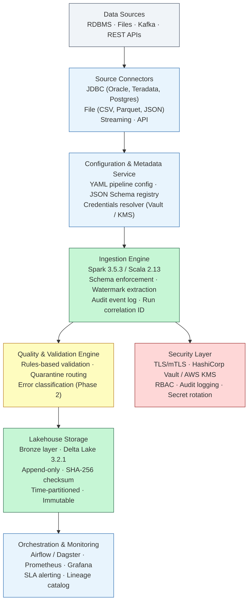

# Critical Infrastructure Data Frameworks

**Standardized, open-source reference architectures for secure, reliable data systems in regulated critical-infrastructure sectors.**

[](https://opensource.org/licenses/Apache-2.0)
[](https://github.com/airdmhund1/critical-infra-data-frameworks/actions/workflows/ci.yml)
[](https://github.com/airdmhund1/critical-infra-data-frameworks/actions/workflows/dependency-check.yml)
[](https://github.com/airdmhund1/critical-infra-data-frameworks/releases)

## Project Summary

This framework delivers a configuration-driven Spark/Scala ingestion engine for regulated critical-infrastructure environments. Phase 1 (v0.1.0) includes: JDBC source connectors for Oracle, Teradata, and Postgres; file source connectors for CSV, Parquet, and JSON; a Bronze-layer writer using Delta Lake with time-partitioned, append-only writes; an audit event log; and Kubernetes and Docker packaging. New data sources are onboarded by adding a YAML configuration file — no pipeline code is written per source.

Design constraints that make the framework usable in regulated environments: schema enforcement via ADR-005 (strict or discovered-and-log modes — no silent Spark inference), watermark-based incremental extraction with failure-safe watermark advancement, external secrets management via HashiCorp Vault or AWS KMS (no credentials in configuration files), SHA-256 batch checksum computed from raw input rows before Bronze write, append-only Delta table properties enforced after each write, and an audit event log written on every pipeline run regardless of success or failure. Technology stack: Apache Spark 3.5.3, Delta Lake 3.2.1, Scala 2.13, Kubernetes-deployable, Apache 2.0.

## Problem Statement

The National Cybersecurity Strategy (2023) Pillar One identifies persistent data infrastructure fragmentation as a systemic risk to critical-infrastructure sectors — organisations building one-off systems for each data source produce inconsistent security postures with no standardised baseline for regulators to evaluate. The DOE Artificial Intelligence Strategy (2025) names "persistent data silos" and "legacy infrastructure" as specific barriers to secure AI adoption in the energy sector, and calls for standardised data infrastructure.

The concrete operational consequence: each organisation bears the full burden of selecting, integrating, securing, and validating Apache Spark, Delta Lake, Vault, Kubernetes, and Prometheus — individually, against its own regulatory requirements. Teams building from scratch for each source incur weeks of development per source, produce inconsistent schema enforcement and audit trails, and must re-solve credential management, watermark tracking, and quarantine design independently. This framework provides a tested, documented, and compliance-mapped starting point that reduces that duplication.

## Architecture Overview



See [docs/reference-architecture.md](docs/reference-architecture.md) for the full architecture description, component interactions, and deployment patterns.

## Quick Start

Get the local development environment running in 15 minutes — no Spark or Java installation required.

**Prerequisites:** Docker Engine 24+ (includes Compose v2), Git.

```bash
git clone https://github.com/airdmhund1/critical-infra-data-frameworks.git
cd critical-infra-data-frameworks
cp deployment/docker/.env.example deployment/docker/.env
# Edit deployment/docker/.env — replace all `replace-me` placeholders
docker compose -f deployment/docker/docker-compose.yml --env-file deployment/docker/.env up -d
```

See [docs/getting-started.md](docs/getting-started.md) for the full step-by-step guide including Vault credential seeding, MinIO bucket creation, and running the smoke test.

## Configuration Guide

Pipeline sources are defined in YAML configuration files — no custom code required for new source onboarding. The configuration schema covers connectivity (JDBC, file, Kafka, API), schema enforcement mode (strict or discovered-and-log), ingestion strategy (full or watermark-based incremental), quarantine settings, and audit configuration.

See [docs/configuration-schema.md](docs/configuration-schema.md) for the full schema reference.

## Sector Examples

Annotated pipeline configuration files for financial services and energy are in [`examples/configs/`](examples/configs/). Key compliance-driven fields are highlighted below.

### Financial Services — Oracle Trade Execution Records (Dodd-Frank)

Source: [`examples/configs/financial-services-oracle-trades.yaml`](examples/configs/financial-services-oracle-trades.yaml)

```yaml
metadata:
  sector: "financial-services"   # Activates Dodd-Frank compliance enforcement paths

ingestion:
  mode: "incremental"
  incrementalColumn: "TRADE_TIMESTAMP"
  watermarkStorage: "s3://pipeline-state/watermarks/fs-oracle-trades-001"
  # Watermark persisted to S3 so a failed run re-covers the window on retry — no records
  # fall between runs. Required for reproducible, gap-free extraction (Dodd-Frank audit trail).

schemaEnforcement:
  mode: "strict"                 # Per ADR-005: silent schema inference prohibited.
  registryRef: "schemas/financial-services/trade-execution-v2.json"
  # Schema violations abort the pipeline; corrupt records are never written to Bronze.

storage:
  format: "delta"                # ACID transactions and time travel for audit compliance.

audit:
  immutableRawEnabled: true      # Write-once enforcement on Bronze path; satisfies
  #                              # Dodd-Frank 17 CFR Part 45 immutable recordkeeping obligation.
  retentionDays: 2555            # 7-year retention minimum for U.S. financial services
  #                              # regulatory reporting (2555 days).
```

### Energy — EV Charging Station Telemetry (NERC CIP)

Source: [`examples/configs/energy-ev-telemetry-csv.yaml`](examples/configs/energy-ev-telemetry-csv.yaml)

```yaml
metadata:
  sector: "energy"               # Activates NERC CIP compliance enforcement paths.

connection:
  fileFormat: "csv"              # Selects CsvFileConnector via the connector registry.

schemaEnforcement:
  mode: "strict"                 # Per ADR-005: CsvFileConnector applies the registered schema on read.
  registryRef: "schemas/energy/ev-charging-telemetry-v1.json"
  # Non-conforming records raise ConnectorError — no silent pass-through.

ingestion:
  mode: "full"                   # Nightly drop pattern; each run processes the complete file delivery.

quarantine:
  enabled: true                  # Malformed telemetry records written to quarantine with error codes,
  #                              # never silently dropped. Supports NERC CIP-007 R5 data integrity.

audit:
  immutableRawEnabled: true      # NERC CIP-007 R5 data-integrity requirement: write-once on Bronze path.
  retentionDays: 1825            # 5-year retention (1825 days); satisfies NERC CIP-007 R5 and
  #                              # CIP-008 R3 event-log and incident-response recordkeeping requirements.
```

## Compliance Mapping

The framework maps to four U.S. regulatory frameworks: Dodd-Frank Act enhanced prudential standards (financial services), NERC CIP-007 and CIP-008 (energy critical infrastructure protection), NIST Cybersecurity Framework 2.0 (cross-sector), and the National Cybersecurity Strategy 2023 (Pillar One).

See [docs/compliance-mapping.md](docs/compliance-mapping.md) for the field-level mapping between framework capabilities and specific regulatory controls.

Note: the compliance mapping documents where framework capabilities *support* regulatory requirements. This is not a certification or legal opinion.

## Architecture Decision Records

The [Architecture Decision Records](docs/architecture-decisions.md) document the significant technical choices made during Phase 1 development — including the selection of Apache Spark/Scala, the configuration-driven pipeline design, Delta Lake storage, watermark-based incremental extraction, explicit schema enforcement, and external secrets management.

Each ADR captures: the context that made a decision necessary, the decision taken, the rationale and evidence behind it, the alternatives considered and rejected, and the consequences for operators and contributors.

## Roadmap

See [ROADMAP.md](ROADMAP.md) for the detailed phased release plan.

**Phase 1** (Months 1–2): Core ingestion framework and documentation  
**Phase 2** (Months 3–4): Quality validation engine and monitoring templates  
**Phase 3** (Months 5–6): Compliance mapping, deployment guides, and community engagement

## Contributing

See [CONTRIBUTING.md](CONTRIBUTING.md) for guidelines on how to contribute to this project.

## License

This project is licensed under the Apache License 2.0 — see [LICENSE](LICENSE) for details.

## Author

**Edmund Adu Asamoah**  
MSc Big Data Technologies | Data & Software Engineer  
[LinkedIn](https://www.linkedin.com/in/eaduasamoah) | [Portfolio](https://easolutionz.com)
